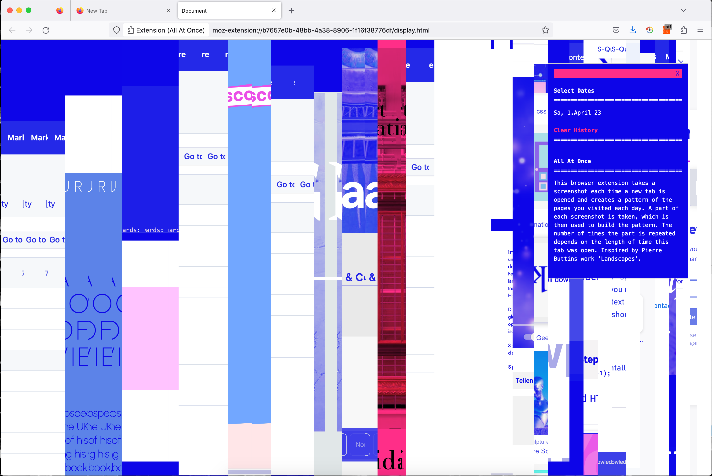
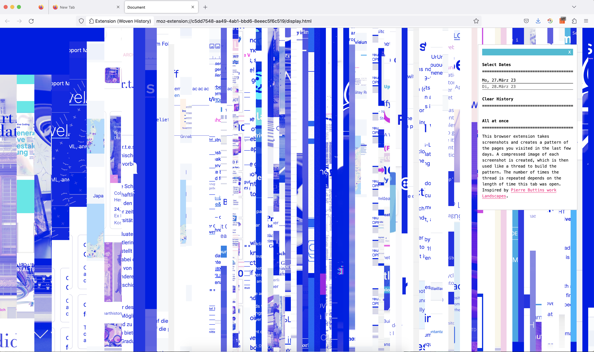

# All At Once
## Firefox Browser Extension, Artistic, Visualization Personal History

This firefox browser extension takes screenshots and creates a pattern of the pages you visited during the last 10 days. A compressed image of each screenshot is created, which is then used to build the pattern. The number of times the image is repeated depends on the length of time this tab was open. Each day creates its unique visual representation. Inspired by Pierre Buttins artwork Landscapes.

Install for Firefox on https://hzuellig.github.io/all-at-once/

 

